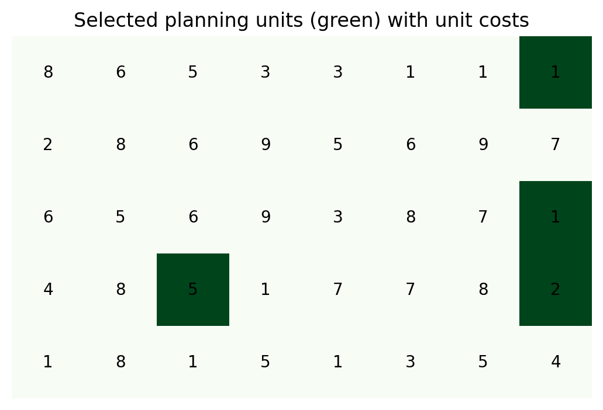

# conservation-reserve-selection
# Reserve Selection: Minimum-Cost Conservation Planning

A small integer linear programming model for systematic conservation planning.

## Problem
Given a grid of planning units, each with a cost and a set of biodiversity
features it contains, select the cheapest set of units so that every feature
is represented at least once (minimum set cover).

## Formulation
- **Decision variables:** x_i ∈ {0,1}, 1 if unit i is selected
- **Objective:** minimise total cost, Σ cost_i · x_i
- **Constraints:** for each feature j, Σ x_i ≥ 1 over units i containing j

## How to run
`pip install -r requirements.txt`, then open `reserve_selection.ipynb`
(or run it in Google Colab). Uses PuLP with the CBC solver.

## Result

## Next steps
- Budget-constrained version (maximise features covered)
- Representation targets (e.g. 30% of each feature)
- Dynamic version: selecting units over multiple time periods
- Apply to spatial data from Gilgit-Baltistan (e.g. early-warning sensor placement for glacial lake risk)
